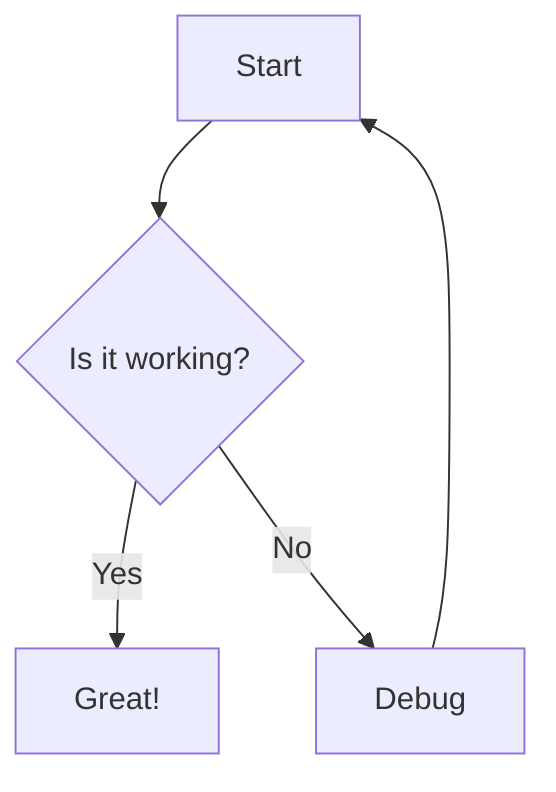
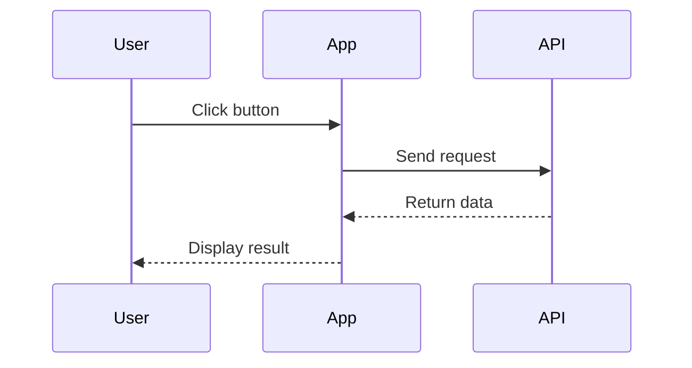
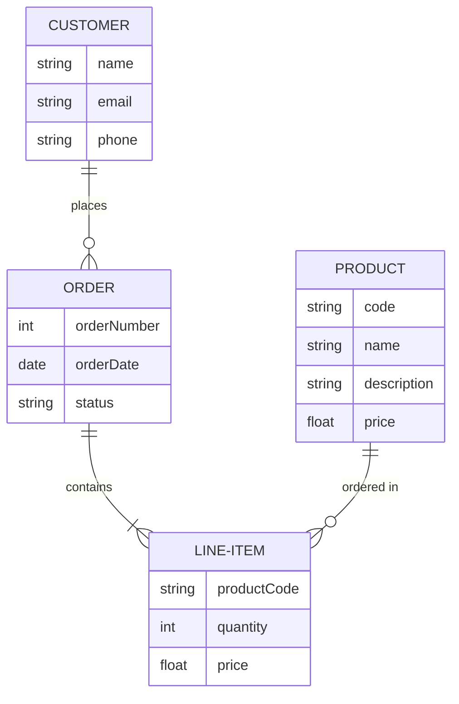
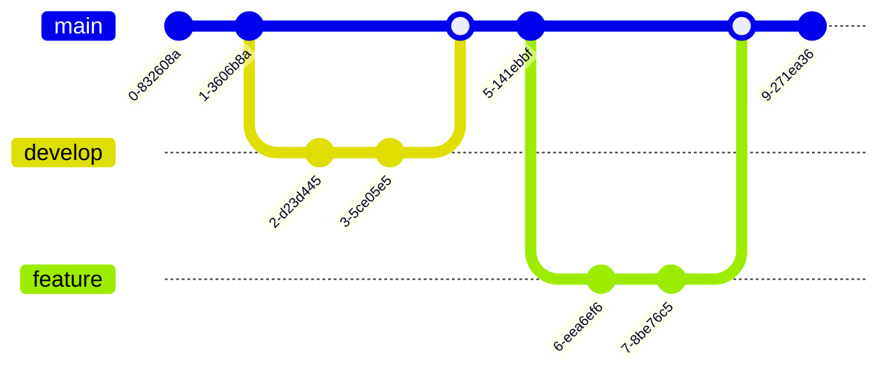
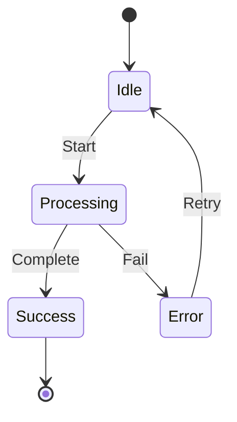
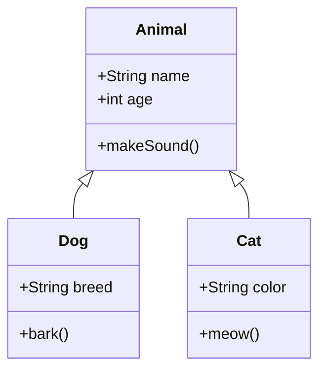
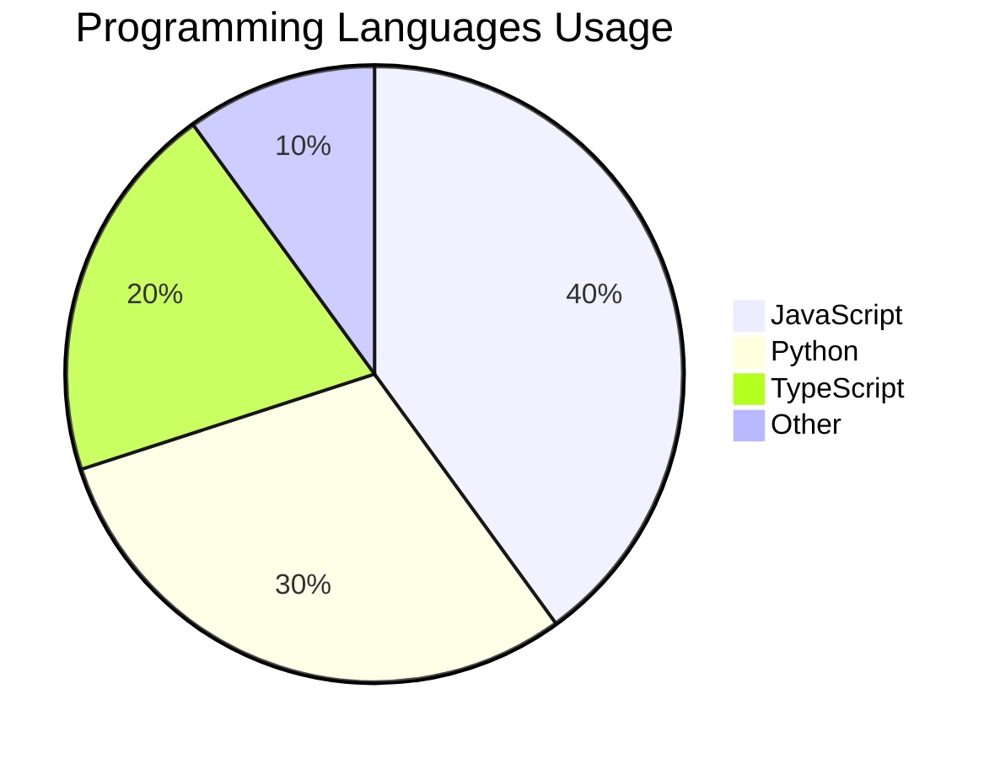
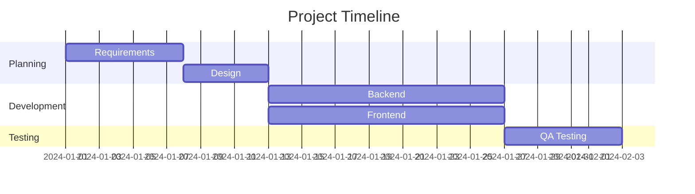

# Mermaid Diagram Examples

All diagram types are supported including ER diagrams and Git graphs!

## Flowchart

## Sequence Diagram

## ER Diagram (Entity Relationship)

## Git Graph

## State Diagram

## Class Diagram

## Pie Chart

## Gantt Chart

