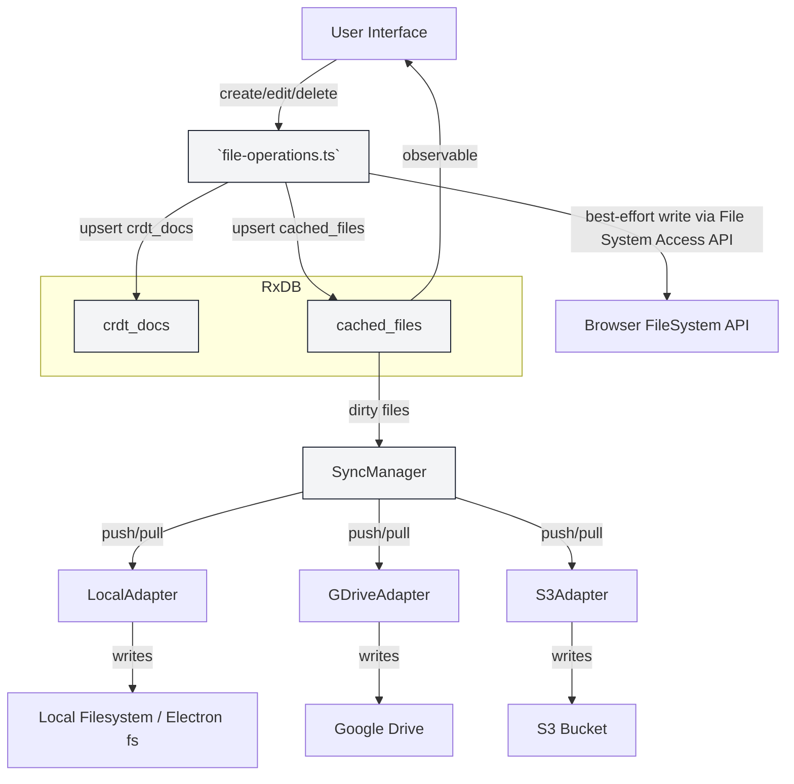

## File CRUD Workflow: UI -> RxDB -> SyncManager -> Adapters

This document explains how file create/read/update/delete (CRUD) operations flow through the system, how edits are persisted in the RxDB cache, and how the SyncManager coordinates pushing changes to external adapters (local filesystem, Google Drive, S3, etc.).

**Actors**
- UI: file-explorer and editor components (user actions: create, edit, rename, delete)
- File Operations: `src/core/cache/file-operations.ts` (single source-of-truth API)
- RxDB: `cached_files` and `crdt_docs` collections (persistence + CRDT storage)
- SyncManager: `src/core/sync/sync-manager.ts` (observes RxDB, orchestrates sync)
- Adapters: implementations in `src/core/sync/adapters/*` (LocalAdapter, GDriveAdapter, S3Adapter)
- Target Storage: actual filesystem, Google Drive, S3, or browser IndexedDB (samples)

High-level principles
- RxDB is the single source of truth for UI state: UI writes go to RxDB first.
- Text content is stored in CRDT docs (`crdt_docs`) as a base64 Yjs state.
- Metadata and path information are stored in `cached_files` and include `workspaceType`, `workspaceId`, `crdtId`, and a `dirty` flag.
- For non-browser workspaces, changes are marked `dirty` and SyncManager will attempt to push them to the configured adapter(s).
- Browser workspaces are local to IndexedDB and do not require adapters.

Detailed flow (per operation)

1) Create (UI)
- User initiates file/folder create in the UI.
- UI helper (e.g., `src/features/file-explorer/store/helpers/file-operations.ts`) calls `initializeFileOperations()` (if needed) then `saveFile()` or `createDirectory()`.
- `saveFile()` / `createDirectory()` in `file-operations.ts`:
  - Upserts/creates a `crdt_docs` record containing the file content (stored as base64 UTF-8 string in `yjsState`).
  - Upserts a `cached_files` record containing `id`, `path`, `name`, `workspaceType`, `workspaceId`, `crdtId`, `dirty` flag, etc.
  - For `workspaceType === 'local'` in a browser, the code will attempt an immediate, best-effort write using the File System Access API if a directory handle is stored (via `src/shared/utils/idb-storage`). This is non-blocking and non-fatal on failure.
  - The UI receives the new file metadata via RxDB observable queries.

2) Edit / Save (Editor)
- Editor logic (`useEditorSync`, `useOpenFileForEditing`) loads content from CRDT via `crdt_docs` and shows it in the editor.
- On content change, editor calls `saveFile()` (or the same save API). `saveFile()` updates `crdt_docs` (raw content) and `cached_files` (dirty flag). This is the authoritative write.
- SyncManager (if running) observes `cached_files` via `observeCachedFiles()` or polls `getDirtyCachedFiles()` and acts on files with `dirty === true` and `workspaceType !== 'browser'`.

3) SyncManager → Adapter Push & Pull
- For each dirty file, SyncManager: 
  - Reads `crdt_docs` for the file's `crdtId` and decodes the base64 `yjsState` into a Uint8Array.
  - Tries to `push()` the file state to registered adapters (LocalAdapter, GDriveAdapter, etc.). `pushWithRetry()` handles retries and backoff.
  - If an adapter returns success, SyncManager marks the cached file as synced (`markCachedFileAsSynced`), clearing the `dirty` flag.
  - SyncManager may also `pull()` remote state from adapters and merge it into the local CRDT (currently the implementation overwrites CRDT with remote base64 state; CRDT merging may be re-enabled later).

4) Delete / Rename
- UI calls `deleteFile()` or `renameFile()` in `file-operations.ts` which:
  - Removes/updates entries in `cached_files` and `crdt_docs` accordingly.
  - Attempts best-effort filesystem operations for `workspaceType === 'local'` when a directory handle is available (delete/rename using File System Access API).
  - SyncManager adapters may also implement delete/rename semantics when running in an environment that supports them (e.g., Node/Electron LocalAdapter uses `fs`).

Notes on workspace types and scoping
- `workspaceType` values: `browser`, `local`, `gdrive`, `s3`.
- `workspaceId` is optional and used to scope `cached_files` to a particular mounted workspace (e.g., multiple local mounts).
- `getCachedFile(idOrPath, workspaceId)` supports lookup by `id` or by `path` and will attempt workspace-scoped lookup first when `workspaceId` is provided.

Local (browser) specifics
- When running in a browser and the user created a Local workspace, the app stores a File System Access API directory handle using `src/shared/utils/idb-storage` (persisted in an IndexedDB store named `verve-storage`).
- `file-operations.ts` performs a non-blocking attempt to write to that handle on `saveFile()`, `createDirectory()`, `deleteFile()`, and `renameFile()`. These attempts are best-effort and log warnings if they fail (no implicit permission prompts).
- To request permission interactively, call `requestPermissionForWorkspace(workspaceId)` from `src/shared/utils/idb-storage` during a user gesture (button click) before performing large batch writes.

Adapter responsibilities
- `LocalAdapter` (desktop/Electron): uses Node `fs` to write files to disk; may watch filesystem changes (chokidar) and convert filesystem paths to file IDs.
- `GDriveAdapter`: uses Google Drive APIs to upload/download content; must be initialized with an authenticated client.
- `S3Adapter`: integrates with S3-compatible storage (future).

Failure handling and consistency
- RxDB is the authoritative source for file metadata and content. File system / adapter writes are best-effort and may fail independently.
- The `dirty` flag signals unsynced state; SyncManager uses it to retry pushes.
- Conflict resolution: CRDT/Yjs is planned to handle merges; current implementation may overwrite on pull — review `SyncManager.mergeRemoteChanges()` when enabling CRDT merges.

Where to look in code
- UI helpers: `src/features/file-explorer/store/helpers/file-operations.ts`
- Editor hooks: `src/features/editor/store/editor-cache-bridge.ts`
- Cache API (CRUD): `src/core/cache/file-operations.ts` (this is the main single-source API)
- RxDB glue and helpers: `src/core/cache/rxdb.ts` and `src/core/cache/index.ts`
- Sync orchestration: `src/core/sync/sync-manager.ts`
- Adapters: `src/core/sync/adapters/*`
- File handle storage (browser): `src/shared/utils/idb-storage.ts`

Mermaid diagram (high-level)

If you'd like, I can:
- Add a link to this doc in the main README.
- Add a short checklist for testing local workspace flows (permissions, sample write).
- Render and validate the Mermaid diagram and add a PNG or SVG export to the docs directory.

File added: [docs/FILE_CRUD_WORKFLOW.md](docs/FILE_CRUD_WORKFLOW.md)
