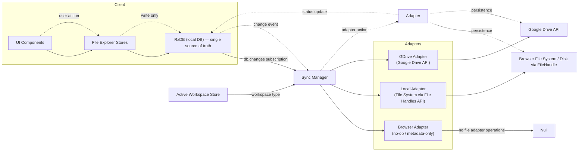

# Workspace File Ops Architecture

This document describes the intended architecture for file operations across different workspace types (browser, local, gdrive). UI components and their stores must only interact with RxDB. The Sync Manager and adapters are responsible for translating RxDB changes into the appropriate workspace-level file system/remote operations.

## High-level flow


```

## Principles / Responsibilities

- UI Components and their stores (e.g., `src/features/file-explorer/store/*`) must only read/write to RxDB. They should never invoke workspace-specific APIs or know about adapter implementations.
- RxDB is the single source of truth for file metadata and content (or pointers to content blobs), and all UI-driven changes are made by updating RxDB records.
- Sync Manager subscribes to RxDB change streams and to the `Active Workspace` selection. The Sync Manager decides which Adapter to use and pushes changes to that adapter.
- Adapters encapsulate all workspace type specifics:
  - Browser adapter: effectively a no-op for external persistence; may update metadata only.
  - Local adapter: manages the File System Access API (FileHandle) for create/read/update/delete of files and directories.
  - GDrive adapter: handles Google Drive REST API / resumable uploads, OAuth, remote file mapping, conflict resolution.
- Adapter implementations must persist operation status and results back to RxDB (e.g., remoteId, syncStatus, lastSyncedAt). This ensures UI can show sync state without talking to adapters.

## Create/Update/Delete sequence (conceptual)

1. User performs action in UI (create / edit / delete file).
2. UI store writes change into RxDB (document create/update/delete). No adapter or workspace type call is made by UI code.
3. Sync Manager receives RxDB change event and inspects the `Active Workspace` type.
4. Sync Manager forwards the change to the selected Adapter which performs the actual filesystem/remote call.
5. Adapter updates RxDB with operation outcome (success/failure, remote id, syncStatus, lastSyncedAt).
6. UI observes RxDB updates and updates UX accordingly.

## Workspace switching

- On active workspace change, Sync Manager:
  - Gracefully disposes (or pauses) the current adapter.
  - Instantiates and initializes the adapter for the new workspace type.
  - Reconciles RxDB state if needed (e.g., reconcile local vs remote metadata).
- The UI and stores remain unchanged during workspace switch; they continue to operate only on RxDB.

## Notes & edge cases

- Conflict resolution strategy should be handled centrally in Sync Manager or adapters (not stores). Strategy examples: last-write-wins, prompt user merge, or operational transforms for rich documents.
- For large file content, store pointers to blobs in RxDB (or use chunked storage) to avoid blocking the UI thread.
- For local adapter using File Handles API, keep handles in a separate secure store and map them to RxDB entries by id.


---

